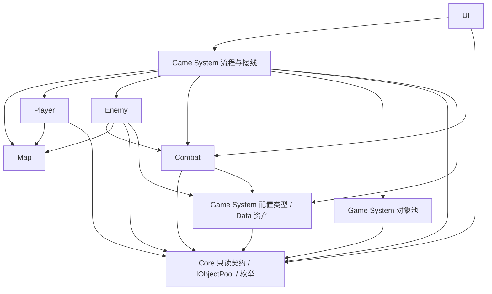
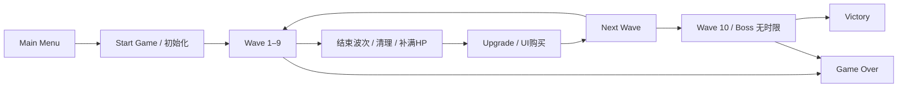

# KWC 技术架构

本文件回答设计如何落到代码与 Unity 工程。玩法与 Scope 以 [KWC_GDD.md](KWC_GDD.md) 为准，数值与公式以 [数值设计.md](数值设计.md) 为准。引用数值表时以**表名和参数名**共同校对，已知旧表号错位见 README。

## 1. 目标与当前交付

这是供 2026–2027 基础开发课程使用的教学 Demo。首先要“适合教”，其次才是“好玩”。选择易读的组件、明确的方法和 C# event，不引入全局 EventBus、万能 Singleton、Service Locator、DI、ECS 或巨型 BaseEntity。

本次只交付可打开、可进入 Play Mode 的工程骨架：两个场景、开发入口、GameManager 状态容器、公共读取/池接口、配置资产、简单对象池。**没有实现移动、索敌、刷怪、伤害、升级、Boss FSM、正式 UI 或存档。** 文中的完整流程是 Owner 后续集成约定，不代表已经完成。

模块可直接读取对方公开的只读状态；改变状态必须向其所有者提出请求。内部实现由 Owner 决定，跨模块契约由主程 Review。未定规则不以默认值偷偷落地。

## 2. 模块职责和依赖

|模块 / Owner|负责 / 核心数据|不负责|输入依赖 / 对外能力|
|---|---|---|---|
|Map / 吴钰涛|场景、地面、通行与碰撞、Tag/Layer、地图资源；空间范围与阻挡事实|随机刷怪、伤害、AI、玩家输入|Unity 场景；向移动和 Spawn 提供空间/有效位置/碰撞事实|
|Player / 陈柏翰|Input System、八方向移动、朝向、Camera/Cinemachine；Transform 与输入状态|HP、伤害、EXP、成长计算、胜负|Map、注入的 IPlayerStats；实现 IPlayerContext，接受流程的控制启停|
|Enemy / 王勤伟|Enemy1 与轮椅骑士 FSM、移动、攻击机会、Dead、Animator、AI Debug；冷却、Dash 快照和命中记录|生命结算、掉落、波次、对象池实现|Map、IPlayerContext、Combat Health/伤害入口、配置；提交命中请求与行为结束结果|
|Combat / 葛亮亮|Weapon、Projectile、Damage/Health、死亡通知、EXP、成长、掉落/拾取；全部战斗数值状态|AI 状态选择、输入移动、波次调度、菜单切换|IPlayerContext、IObjectPool、配置；实现 IPlayerStats，提供伤害/购买请求及结果事件|
|UI / 曾识宇|HUD（HP/EXP/等级/波次/剩余时间/Boss HP）、菜单、暂停、升级、结算；显示与选中状态|扣血、加经验、扣成长点、刷怪、胜负判定|Combat 只读状态和结果、Game System 流程；提交开始/重开/暂停/购买等请求|
|Game System / 王若兰|GameManager、波次、Spawn/预警、池、SO、基础存档、打包/性能；流程及生成计数|攻击公式、移动、Boss 冲刺决策、UI 布局|各模块显式接线；协调初始化/结束/重开，提供配置与复用对象|

Core 是少量公共契约的位置，不是第七个玩法模块，也不承接全局状态。Data 是配置实例的位置，类型归 Game System 维护，参数含义由相应 Owner 与策划共同核对。

## 3. 依赖方向与接线

图中箭头表示**代码读取/调用方向**，不是事件发送方向。配置类型只依赖 Unity 和 Core；SO 不引用场景对象。



- Game System 在场景初始化时将 Player 的 `IPlayerContext`、Combat 的 `IPlayerStats` 和池的 `IObjectPool` 传给需要它们的组件；通过具体组件引用完成接线。Unity Inspector 不直接序列化接口，Owner 用显式 `Initialize(...)` 接收，不做全局查找服务。
- Player 提供实体 Transform、位置、朝向和 `SetControlEnabled`；Enemy/Combat/Spawn 读取位置，不持有 Player 私有字段。
- Player 读取 Combat 的移动属性，但只依赖 Core 契约；Combat 读取 Player 位置也只依赖 Core。二者不互相引用具体类。
- Enemy 调用 Combat 的 Health/伤害组件；Combat 的索敌通过战斗实体/Health 筛选，不能反向依赖 Enemy FSM。具体伤害请求签名、阵营识别和命中载荷：`// 待Owner与主程联调时确认`，当前不预建大型实体体系。
- Combat 通过 `IObjectPool` 申请子弹/掉落；Game System 实现接口，池不调用 Combat。高层流程负责订阅死亡并安排清理。
- UI 订阅结果，底层不引用 UI。订阅者在 `OnEnable` / `OnDisable` 成对绑定与解绑；启用后先读一次快照，避免漏掉先前事件。

### Assembly Definition 决定

初始化阶段不使用 `.asmdef`。六个模块共用 Unity 默认运行时程序集，`Editor` 目录由 Unity 单独编译。教学初期引入六套程序集和额外测试引用的成本大于收益；以上方向靠命名空间、目录和 Review 约束。若后续编译时间成为问题，再由主程按稳定边界拆分，不由个人零散加入。

## 4. 数据唯一所有权

|数据|唯一维护者|读取者 / 说明|
|---|---|---|
|Player Position / Facing|Player 的实体 Transform|Enemy、Combat、Spawn；不得保存第二份可修改位置|
|Player HP（当前值与最大值）|Combat Health / 玩家属性|UI、流程；SO 的 Player HP 只是基础最大值|
|Player Attack|Combat 玩家属性|Weapon、UI|
|Player Movement|Combat 玩家属性|Player 读最新速度；输入方向/移动执行仍归 Player|
|Attack Speed / Attack Interval|Combat 玩家属性 / 推导|间隔按 `100 / Attack Speed` 推导，不另存一份独立可改值|
|EXP / Player Level|Combat 成长|UI；初始等级和经验结转尚未确认|
|Growth Points|Combat 成长|UI 提请求；未花点保留|
|Attribute Rank|Combat 成长|四项各自等级，与玩家等级分开；不设 20 级上限|
|Enemy HP / Boss HP|各实体的 Combat Health 组件|Enemy 订阅 Dead，UI 读 Boss HP，流程收死亡结果|
|Wave Index / Wave Timer|Game System 波次|UI；Boss 波不使用倒计时，UI 显示 Boss 战或无时限|
|Spawn Count|Game System Spawn|累计**实际启用**数量；预警中的预留数量、活着数量另列，不混为一个数|
|Game State|场景内 GameManager|所有模块只读并订阅 GameStateChanged|

配置中的 WaveIndex 是静态关卡标识，不是当前进度。不要修改 SO 来保存当前生命、当前波次、成长点、冷却或池容量使用情况。玩家状态由 Combat 通过 IPlayerStats 提供；Player Prefab 可以同时挂 Player 与 Combat 组件，并不因此把战斗数据转交给 Player 模块。

## 5. 核心运行流程（集成目标）



**启动与波次：** 载入 Game → 配置校验与场景接线 → Combat 建立本局数据 → Player/Enemy 就绪 → Game System 开始 Wave。Wave 1–9 在 30 秒到时结束，或“所有计划敌人实际生成且全部死亡”时提前结束。目标击杀数/期望等级只用于验收，不能作为结束条件。Spawn 到 Actual Spawn Count 停止；未完成红圈预警不能算已经生成。

**波末：** 停止并取消尚未完成的生成/预警 → 清理残余敌人、EXP Orb、Health Pack（不是击杀，不能触发掉落、EXP或击杀计数）→ 请求 Combat 补满玩家 HP → 通知 UI 打开升级界面。下一波启动方式待确认。Wave 10 首次刷怪同时生成 Boss，该行每批 2 只指 E1；“约20 E1”尚不能作为确切上限。Boss 波直到 Boss 或 Player 死亡，不存在 30 秒超时。

**Player 攻击：** Combat 读取玩家位置 → 选择最近有效 Enemy → Weapon 按 Attack Interval 发射一枚 Projectile → 命中 → Damage Request → Combat Health 扣血 → 一次性死亡通知 → Combat 掉 EXP，普通 Enemy 独立判血包掉落。保留 `Weapon Damage × Player Attack / 100`；无暴击/多发/穿透/分裂。飞行速度、索敌范围、追踪与失去目标的处理尚未实现。

**Enemy 攻击：** Enemy1 有效接触立即提交首击 → Combat Player Health 结算；持续接触节奏/重接触重置待确认。Boss Dash → Enemy 验证本次 Dash 尚未命中 → 提交 Dash Damage → Combat Player Health；非 Dash 普通接触无伤害，单次 Dash 最多一次，玩家受击有 GDD 规定的 0.5 秒无敌。

**Enemy 死亡：** Health 首次归零 → Enemy 停行为并进入 Dead → Combat 完成掉落请求 → Game System 回收 → 更新 Spawn/存活统计 → 检查波次。订阅顺序不能决定业务顺序；集成层显式组织各步骤。Boss 死亡与结算先后、同时死亡优先级待确认。每次复用需要新的生命周期标识或重置死亡标记，避免迟到回调影响新一轮实例；具体方式由 Owner 协商。

**升级：** EXP 拾取 → Combat 校验阈值 → LevelUp → Growth Points → 波末进入 Upgrade → UI 发出属性购买请求 → Combat 校验点数与规则 → 扣点、增加 Attribute Rank、计算 Attribute Value → 通知 Player/UI。每级 2 点、每属性级 1 点、无上限。购买 HP 后须实时处理当前 HP，但具体增量/比例规则仍待确认，不能默认“升血量就全满”。

## 6. Game State 与暂停边界

|状态|允许的流程|移动、战斗、计时|
|---|---|---|
|MainMenu|显示入口、开始请求|无本局战斗实例|
|Playing|正常局内流程|Owner 接线完成后推进移动、攻击、AI、Spawn、波次/冷却|
|Upgrade|显示属性、向 Combat 请求购买|GDD 未决定各子系统是否暂停，当前只保留状态定义|
|Paused|暂停 UI、恢复请求|同上；不能仅凭名称默认全部冻结|
|Victory / GameOver|显示结果、重开|结束可操作战斗，取消生成；不再推进本局|

`GameManager` 只拥有 CurrentState、配置引用与 GameStateChanged。当前 `StartGame` 载入 Game，Game 的启动入口进入 Playing；这代表**开发空场景已就绪**，不代表玩法已接线。`EnterUpgrade` 和 `CompleteSession` 提供未来集成入口，后者只接受已由流程裁决的终局结果。

当前不实现暂停/恢复及 Upgrade→下一波的执行策略，不调用 `Time.timeScale = 0`，不把 Playing 以外一概判作全局暂停。Game System Owner 在规则确认后统一定义各系统运行许可，决定使用逻辑开关还是 TimeScale；若采用 TimeScale，UI 用 unscaled 时间，重开/离场恢复尺度。各模块不能自行写 TimeScale。UI 只向流程请求暂停/恢复；未接线入口不要显示为已经可用。

## 7. ScriptableObject 配置

代码位于 `Modules/GameSystem/Configuration`，命名空间 `KWC.Data`；资产位于 `Data`。`GameConfig` 只组合引用，不保存重复数值。GameManager 引用这一个入口资产。初始化时把所需配置显式传给具体组件。

|类型 / 资产|参数来源与内容|
|---|---|
|PlayerBaseConfig / PlayerBase|N01：PlayerHp、PlayerAttack、PlayerMovement、AttackSpeed；均为基础值|
|WeaponConfig / BasicWeapon|N02：WeaponDamage；未定飞行/索敌参数不伪填默认值|
|Enemy1Config / Enemy1|N03：E1Movement、E1AttackSpeed；E1 HP/Attack 由波次提供，不重复存|
|BossConfig / KnightWheelChair|N04：BossHp/Movement、PreferredDistance、WanderRadius/Speed/Interval 范围、全部 Dash 数值、NormalContactDamage|
|CombatRulesConfig / CombatRules|N05：EXP/DropCount/A/B/C；N06：血包概率/回复比例；N07：成长点/价格；GDD：玩家无敌时间|
|AttributeGrowthConfig / AttributeGrowth|N08：四项 B、G，引用 PlayerBase 作为 S₀；不复制 N09 的 0–20 查表值，不设置上限|
|WaveSetConfig / Waves|N10 的 NormalWaveDuration、SpawnWarningTime；N12 的10行数据（Boss 行无时限）；N11/N12 目标仅作为文档验收数据|
|GameConfig / DefaultGameConfig|以上七个 SO 的引用，无运行时状态|

`WaveDefinition` 的 `ActualSpawnCountConfirmed` 保护“约20 E1”的未决状态。Wave 10 记录 `ActualSpawnCount = 0` 且 confirmed=false，0 **不是**确定为不刷 E1；调用 `TryGetActualSpawnCount` 必须成功才能调度。波次资产中的 note 明示原值。未定最小出生距离、首批时间、拾取半径等没有正式配置值；当前骨架不启动 Spawn，Owner 确认后再补字段及校验。

公式留给 Combat 实现：攻击间隔 `100 / AttackSpeed`，伤害 `WeaponDamage × PlayerAttack / 100`，目标 X 级经验 `5 × ceil(A + B(X−2) + C(X−2)²)`；属性 `S₀ + B×R + G×R×(R−1)/2`。初值唯一来自配置，运行时计算与状态不写回资产。变更 SO 参数须与数值源同步，并让相关 Owner Review。

## 8. Prefab 组成与开发边界

本阶段实际提供 `Prefabs/GameSystem/GameManager.prefab`，两场景各实例化一次，序列化引用 DefaultGameConfig。其余 Prefab 由 Owner 按下表交付，当前不生成无行为空壳来假装完成，也不提前选择未确认的物理组件。

|Prefab / 主维护者|建议职责组件（待实现）|复用时复位|
|---|---|---|
|Player / Player|输入移动、朝向、Camera 接线；Combat Health/属性/Weapon|输入开关、速度、局内战斗数据；尺寸按 GDD 1×1×1|
|Enemy1 / Enemy|FSM/运动/接触判断；Combat Health|HP、Dead、攻击间隔、目标、动画；尺寸1×1×1|
|Boss / Enemy|FSM/Dash 命中与墙体检测；Combat Health|HP、冷却、快照、已命中记录；尺寸2×2×2|
|Projectile / Combat|运动、命中请求、回收|目标、伤害快照、寿命/命中标记、Trail|
|ExpOrb / Combat|EXP 值、拾取请求|已拾取标记、数值、表现|
|HealthPack / Combat|拾取与治疗请求|已拾取标记、表现；波末回收，不自然消失|
|SpawnWarning / Game System|红圈表现、预警时间|位置、计时、取消状态|

敌人 Prefab 引用 Combat 组件属于正常组合，不意味着 Enemy 可以改写 Health 内部数据。Player/Enemy 碰撞尺寸已确定，但 Collider 类型、移动平面、Layer Matrix 尚未确定，当前均不强行设置。

## 9. Scene 与基础项目设置

- `MainMenu`：Camera、GameManager Prefab、DevelopmentLauncher。开发入口临时使用 IMGUI 英文状态说明及开始按钮，后续由 UI Owner 替换为正式 UI。
- `Game`：Camera、Light、GameManager Prefab、DevelopmentLauncher；空场景供接线。没有擅自生成地图、墙、玩家或敌人。Camera 是预览相机，位置/投影不是最终 2.5D 视角决策。
- 场景切换采用 Single；GameManager 随场景销毁重建，不设静态 Instance，不用 DontDestroyOnLoad，不跨局保留当前状态。未来基础存档范围另行确认。
- 最终 Scene 仅放环境、Camera、UI 根和组合/接线对象；可复用实体与大块地图放 Prefab。Game Scene 集成由主程协调，Owner 在 Prefab Mode 开发，需独立试验场景时放自己模块目录并在 PR 说明，不提前制造六套场景。
- 标准 3D / Built-in 管线，Unity 2022.3.62f3c1，PC Windows。启用 Input System；安装随该编辑器提供的 Input System、Cinemachine、TextMeshPro、UGUI；不导入教程或第三方资产。TMP Essential Resources 属基础 UI 资源。
- Editor 设为 3D、Visible Meta Files、Force Text。Input Actions 的按键/斜向规则留给 Player。移动平面、2D/3D 物理、重力覆盖、碰撞层、地图尺寸和相机方案确认前保持编辑器默认，不将默认项目设置当成已确认玩法。

Input System 的启用方式参见 [官方安装说明](https://docs.unity3d.com/Packages/com.unity.inputsystem@1.14/manual/Installation.html)。包版本以本工程 manifest / lock 为准，当前未升级到新的引擎大版本。

## 10. 简单对象池

`PrefabPool` 是 Game System 提供的**每种 Prefab 一个池组件**，实现 Core 的 `IObjectPool`。场景显式引用池，不建全局字典服务或泛型框架。

`Rent(position, rotation, initialize)` 在停用状态下取出实例、设置位置、调用 Owner 的初始化委托，然后激活；因此 `OnEnable` 能读取已经复位的本轮数据。初始化不能依赖尚未执行的 Start。`Return` 只接受本池借出的实例，拒绝重复/跨池归还；停用后放回。`ReturnAll` 用于波末/重开清理，不能模拟死亡。

当前实现按需创建，池自身不设置游戏数量上限、不自动淘汰借出实例，未配置 Prefab 时明确报错；这是开发期基础能力，不代表已确定性能容量。实际使用哪些池、预热数量/硬容量与不足策略由 Game System Owner 按联调和性能结果确认。

优先候选：Enemy、Projectile、ExpOrb、HealthPack、SpawnWarning。Boss 数量少，可由 Owner 选择直接创建/销毁。HP、死亡标记、AI、冷却、子弹目标、Dash 命中记录、拾取标记、粒子/Trail/协程/事件订阅都由各组件在初始化/OnDisable 清理。Owner 不直接 Destroy 借出的实例；延迟回调不能回收已借给下一轮的对象。

## 11. 方法、事件与公共契约

当前实际契约：`IPlayerContext`（空间和控制）、`IPlayerStats`（战斗只读视图）、`IObjectPool`（申请/归还）；枚举 `GameState`、`AttributeType`。没有预建无实现的 Manager 列表。

|通信|所有者|建议使用方式|
|---|---|---|
|GameStateChanged|GameManager|已实现实例 event，携带新状态；界面/控制响应|
|HPChanged / EXPChanged / LevelUp|Combat|Owner 后续定义实例 event；UI 先读快照再响应|
|EnemyDied / PlayerDied / BossDied|Combat（生命事实）|流程订阅并明确处理顺序；Enemy 响应状态，禁止重复死亡通知|
|WaveChanged / WaveEnded|Game System 波次|UI 读取进度；波末协调清理/补满/升级|
|购买属性 / 伤害 / 初始化 / 池申请|对应状态所有者|明确方法调用并返回结果；不是“一切广播”|

除 GameStateChanged 外，上表事件尚未创建，签名在实际接入时由主程和 Owner 审核。只读接口不是可写状态副本，UI 不缓存一套成长点去自行结算。

## 12. 实际目录

```text
Assets/
  KWC/
    Core/                       # 公共枚举及3个小接口
    Modules/
      Map/                      # Owner说明，后续地图脚本
      Player/                   # Owner说明，后续输入与相机
      Enemy/                    # Owner说明，后续FSM
      Combat/                   # Owner说明，后续战斗与成长
      UI/                       # Owner说明，后续正式界面
      GameSystem/
        Configuration/          # SO类型与WaveDefinition
        GameManager.cs
        DevelopmentLauncher.cs
        PrefabPool.cs
    Data/                       # 8份SO资产，按类型命名
    Prefabs/
      GameSystem/               # GameManager.prefab
    Scenes/                     # MainMenu.unity、Game.unity
    Art/                        # 资源约定，不引入P1美术
    Editor/                     # 一次性搭建、验证和构建工具
  TextMesh Pro/                 # Unity官方Essential Resources
```

各模块的 README 明确开发位置和边界。正式 Prefab 随交付放到 `Prefabs/<模块>`；美术放 `Art/<模块>`。未使用 Audio 不建空资源堆，P1 音效批准后再加。所有资产/目录 `.meta` 跟随提交，文件移动从 Unity Project 窗口执行。

## 13. 够用的规范

- 类型/方法/属性用 PascalCase，局部变量/私有字段用 camelCase；私有 Inspector 字段 `[SerializeField] private`，对外只读属性。
- 类型与 `.cs` 同名，每文件一个主要 Unity 组件/SO。`KWC.Core`、`KWC.Player`、`KWC.Combat` 等按模块；配置统一 `KWC.Data`，编辑器工具 `KWC.Editor`。
- Prefab 用 `Player`、`Enemy1`、`BossKnightWheelChair`、`Projectile` 等具体名；Scene 用 MainMenu/Game；SO 类型用 `...Config`、资产用 `PlayerBase`/`Waves` 等。
- 四空格、UTF-8、LF。注释解释职责/原因/未定规则，不逐行翻译代码。禁止公共可写字段作为跨模块状态入口。
- 不在 Update 反复 Find/GetComponent；初始化缓存引用。先写清楚的直线流程，再按真实重复提取工具。

## 14. Owner 开发与集成

王艺子杨负责架构、公共接口、Review、最终集成和版本；各 Owner 的姓名和职责保持 GDD 原样。Owner 自主设计模块内部实现。跨模块接口/数据结构、Core/Shared、项目级基类、Game State、Packages/ProjectSettings 和公共 Scene 结构须主程 Review。

第一轮并行：Map 提供通行/空间接口；Player 实现 IPlayerContext 并约定移动属性注入；Combat 实现 IPlayerStats 与 Health/伤害入口；Enemy 对接两者；UI 根据状态快照搭建界面；Game System 完成场景接线、Spawn 与配置校验。接口需要同步确定时先给小 PR，不各自复制同名状态类。

教学阶段从稳定提交打 Tag，功能缺失的早期阶段也应可打开运行并明确教学目标。未来课程拆分不依靠同时维护七条长期分支。
